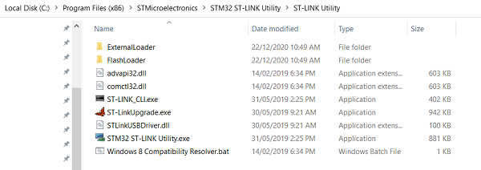

## Firmware update for STM32F4Discovery Board
The Stm32f4Discovery board has an issue where it will not execute code when plugged in to an external power source that is not a computer e.g. USB power bank, USB power adapter. This is resolved by updating the firmware.

---

### Windows Instructions

**1)** First download the latest St-Link utility [here](https://www.st.com/en/development-tools/stsw-link004.html "St-Link Utility"). You will have to register with a real e-mail address to download it.

**2)** Install the utility via the executable. This will also install the latest driver.

**3)** Navigate to where the utility is installed, I was not able to search for it using windows.

**4)** Open the utility and find the Firmware Update option in the menu.

**5)** Click "Device Connect", then "Yes>>>". Your board's firmware will be updated.

**6)** Finally - Unplug and re-plug your board in to your computer. Code you upload should now run with the board connected to an external power supply.

---

### Mac OS instructions
A solution exists to update the firmware via a computer running Mac OS, however users have reported problems with java when trying this. Feel free to try it out via this [link](https://www.st.com/en/development-tools/stsw-link007.html "St-link Firmware Update").